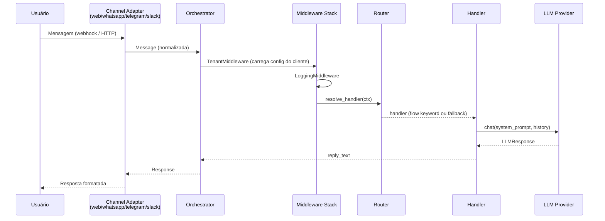
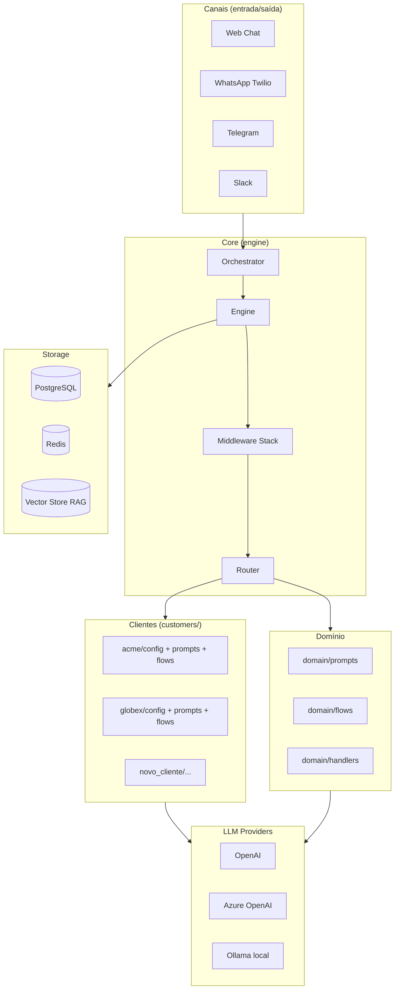
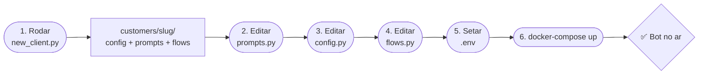
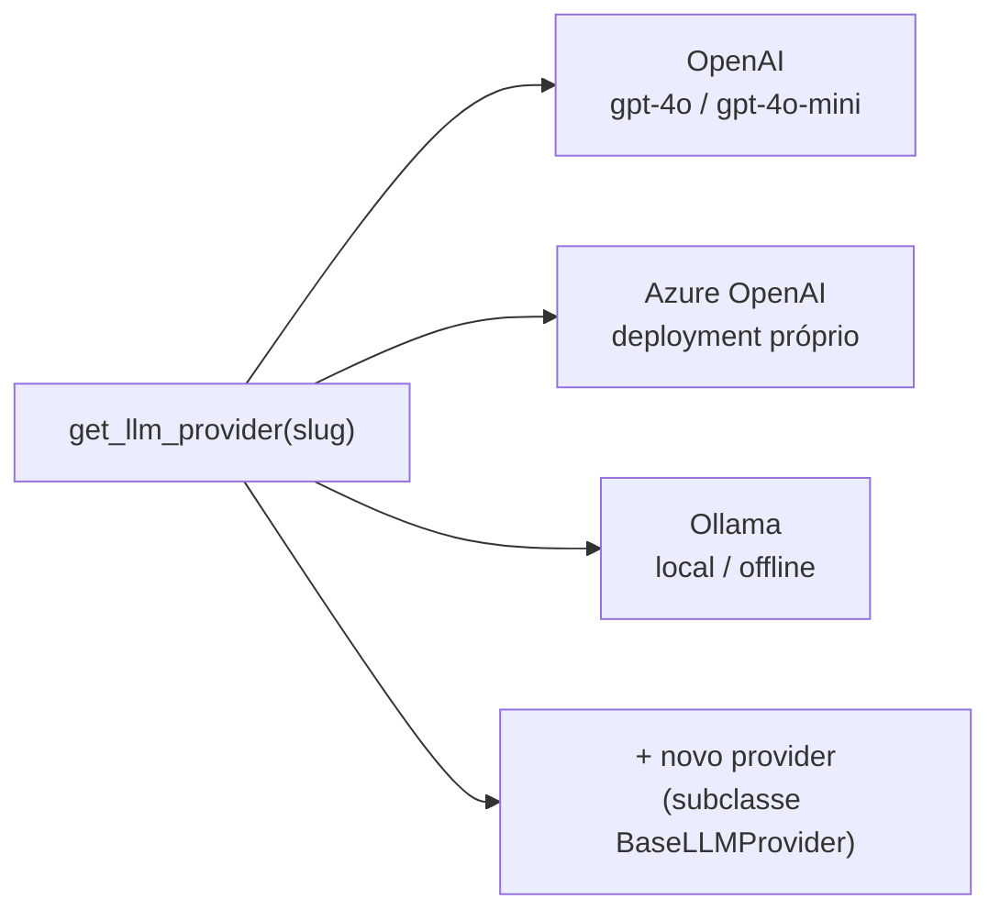

# Framework Multi-Tenant de Chatbot

Framework para deploy rápido de chatbots personalizados por cliente, com suporte a múltiplos canais e provedores de LLM.

---

## Fluxo de uma mensagem



---

## Arquitetura de camadas



---

## Como um novo cliente é adicionado



---

## Estrutura de pastas

```text
multi_tenant_app/
├── backend/
│   ├── Dockerfile
│   ├── requirements.txt
│   ├── .env.example                  ← copiar para .env e preencher
│   ├── examples/
│   │   ├── simple_console_bot/       ← testar qualquer tenant no terminal
│   │   └── whatsapp_bot/             ← app mínimo só com WhatsApp
│   └── src/
│       ├── main.py                   ← entrada FastAPI (lifespan, routers)
│       ├── api/
│       │   └── admin.py              ← endpoints de gestão de tenants
│       ├── channels/
│       │   ├── base.py               ← contrato BaseChannel (ABC)
│       │   ├── web_chat.py           ← POST /chat/{slug} ✅ implementado
│       │   ├── telegram.py           ← sketch com roteiro
│       │   ├── whatsapp_twilio.py    ← sketch com roteiro
│       │   └── slack.py              ← sketch com roteiro
│       ├── config/
│       │   └── settings.py           ← Pydantic BaseSettings + todas as env vars
│       ├── core/
│       │   ├── message.py            ← Message, Response, ConversationTurn
│       │   ├── context.py            ← ConversationContext (estado do turno)
│       │   ├── engine.py             ← pipeline middleware → router → handler
│       │   ├── orchestrator.py       ← entry point chamado pelos canais
│       │   ├── router.py             ← resolve handler por keyword
│       │   ├── middleware.py         ← protocolo + LoggingMiddleware
│       │   ├── tenant_middleware.py  ← carrega TenantConfig no contexto
│       │   ├── agent.py              ← ReAct loop / tool calling (sketch)
│       │   └── errors.py             ← hierarquia de exceções
│       ├── customers/
│       │   ├── base.py               ← TenantConfig (dataclass contrato)
│       │   ├── loader.py             ← auto-discovery + registry cacheado
│       │   ├── acme/                 ← cliente exemplo completo
│       │   │   ├── config.py
│       │   │   ├── prompts.py
│       │   │   └── flows.py
│       │   └── globex/               ← segundo exemplo (configs diferentes)
│       ├── domain/
│       │   ├── prompts.py            ← BASE_SYSTEM_PROMPT (fallback genérico)
│       │   ├── flows.py              ← FLOWS padrão (saudações, etc.)
│       │   └── handlers.py           ← llm_reply(), greeting(), fallback()
│       ├── llm/
│       │   ├── base.py               ← BaseLLMProvider (ABC)
│       │   ├── __init__.py           ← factory get_llm_provider()
│       │   ├── openai_provider.py    ← ✅ implementado
│       │   ├── azure_openai.py       ← ✅ implementado
│       │   └── local_ollama.py       ← ✅ implementado
│       ├── rag/
│       │   ├── retriever.py          ← busca semântica (sketch)
│       │   └── indexer.py            ← indexação de documentos (sketch)
│       ├── storage/
│       │   ├── database.py           ← engine async + get_db() dependency
│       │   ├── tenancy.py            ← TenantRepository (queries isoladas)
│       │   ├── tenant_provisioning.py← provisionar tenant no banco
│       │   └── models/
│       │       ├── base_model.py     ← Base SQLAlchemy + timestamps
│       │       ├── configs.py        ← TenantConfigRecord
│       │       ├── users.py          ← User
│       │       └── messages.py       ← MessageRecord (histórico)
│       ├── tools/
│       │   └── __init__.py           ← registry de tools para o Agent
│       └── utils/
│           ├── logging.py            ← setup_logging() + get_logger()
│           ├── ids.py                ← new_session_id(), new_event_id()
│           └── time.py               ← utcnow(), greeting_for_hour()
├── docs/
│   ├── checklist-novo-cliente.md     ← o que coletar antes de implementar
│   └── guia-implementacao.md         ← passo a passo do zero ao go-live
├── infra/
│   └── docker/
│       └── docker-compose.yml        ← backend + postgres + redis
├── scripts/
│   └── new_client.py                 ← scaffolding de novo cliente
└── .gitignore
```

---

## Início rápido (local)

```bash
# 1. Instalar dependências
python -m venv .venv && source .venv/bin/activate
pip install -r backend/requirements.txt

# 2. Configurar ambiente
cp backend/.env.example backend/.env
# editar backend/.env com OPENAI_API_KEY e demais variáveis

# 3. Subir o servidor
cd backend && uvicorn src.main:app --reload --port 8000

# 4. Testar com o cliente de exemplo
curl -X POST http://localhost:8000/chat/acme \
  -H "Content-Type: application/json" \
  -d '{"user_id": "eu", "text": "olá"}'
```

Ou com Docker (inclui PostgreSQL e Redis):

```bash
docker-compose -f infra/docker/docker-compose.yml up --build
```

---

## Adicionar um novo cliente

```bash
# Cria a estrutura de arquivos automaticamente
python scripts/new_client.py <slug> "<Nome do Cliente>"

# Exemplo:
python scripts/new_client.py initech "Initech Ltda"
```

Depois edite os 3 arquivos gerados em `backend/src/customers/initech/`:

| Arquivo | O que fazer |
|---------|-------------|
| `prompts.py` | Escrever o system prompt (tom, escopo, guard rails) |
| `config.py` | Definir canais, modelo LLM, flags e extras do cliente |
| `flows.py` | Adicionar respostas fixas por palavra-chave |

Reinicie o servidor — o loader detecta o novo pacote automaticamente.

---

## Provedores de LLM suportados



Configurado via `LLM_PROVIDER` no `.env` ou por tenant em `config.py`.

---

## Canais suportados

| Canal | Status | Endpoint |
|-------|--------|----------|
| Web Chat | ✅ Implementado | `POST /chat/{slug}` |
| Telegram | 🔧 Sketch pronto | `POST /channels/telegram/{slug}` |
| WhatsApp (Twilio) | 🔧 Sketch pronto | `POST /channels/whatsapp/{slug}` |
| Slack | 🔧 Sketch pronto | `POST /channels/slack/{slug}` |

---

## Documentação

| Documento | Descrição |
|-----------|-----------|
| [docs/checklist-novo-cliente.md](docs/checklist-novo-cliente.md) | O que levantar com o cliente antes de implementar |
| [docs/guia-implementacao.md](docs/guia-implementacao.md) | Passo a passo do zero ao go-live |
