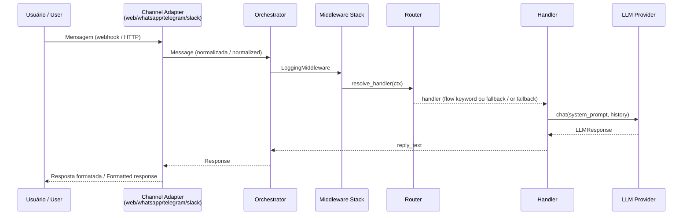
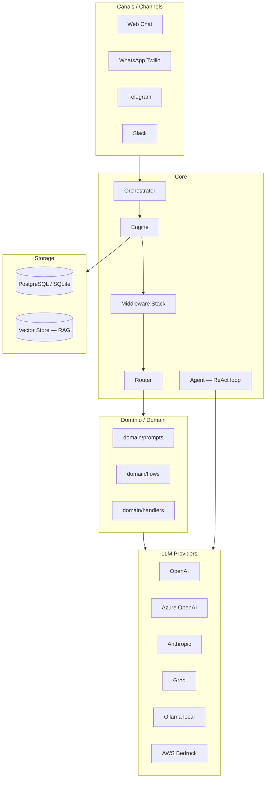

# Chatbot & AI Agent Template

Template para criar chatbots e agentes de IA com suporte a múltiplos provedores de LLM e canais de mensagem.
Template for building chatbots and AI agents with support for multiple LLM providers and messaging channels.

---

## Fluxo de uma mensagem / Message flow



---

## Arquitetura de camadas / Layer architecture



---

## Início rápido / Quick start

```bash
# 1. Instalar dependências / Install dependencies
uv sync --extra dev

# 2. Configurar ambiente / Configure environment
cp backend/.env.example backend/.env
# editar backend/.env com as API keys / edit backend/.env with API keys

# 3. Subir o backend / Start the backend
cd backend && uv run uvicorn src.main:app --reload --port 8000

# 4. Subir o frontend (outra aba) / Start the frontend (another tab)
cd frontend && uv run python serve.py

# Ou ambos com um comando / Or both with one command
make run
```

Ou com Docker (inclui PostgreSQL) / Or with Docker (includes PostgreSQL):

```bash
docker-compose -f infra/docker/docker-compose.yml up --build
```

---

## Configuração do bot / Bot configuration

**`backend/src/config/settings.py` é o único arquivo de configuração.**
**`backend/src/config/settings.py` is the single configuration file.**

Edite `CONFIG = BotConfig(...)` para personalizar / Edit `CONFIG = BotConfig(...)` to customize:

| Campo / Field | Descrição / Description |
|---|---|
| `name` | Nome exibido ao usuário / Display name |
| `system_prompt` | Instrução base do LLM / Base LLM instruction |
| `flows` | Dict `keyword → handler` para respostas fixas / Fixed-response keyword map |
| `llm_provider` | Sobrepõe `LLM_PROVIDER` do `.env` / Overrides `.env` `LLM_PROVIDER` |
| `llm_model` | Sobrepõe `LLM_MODEL` do `.env` / Overrides `.env` `LLM_MODEL` |
| `rag_enabled` | Habilita busca semântica / Enables semantic search |
| `history_window` | Número de turnos no contexto / Number of turns in context |

Via CLI:

```bash
make config-show                        # ver config atual / show current config
make config-set k=name v="Meu Bot"      # alterar campo / change field
make config-reset                       # voltar aos defaults / reset to defaults
```

---

## Provedores de LLM suportados / Supported LLM providers

| Provider | Env vars necessárias / Required env vars |
|---|---|
| `openai` | `OPENAI_API_KEY`, `OPENAI_MODEL` |
| `azure_openai` | `AZURE_OPENAI_API_KEY`, `AZURE_OPENAI_ENDPOINT`, `AZURE_OPENAI_DEPLOYMENT` |
| `anthropic` | `ANTHROPIC_API_KEY`, `ANTHROPIC_MODEL` |
| `groq` | `GROQ_API_KEY`, `GROQ_MODEL` |
| `ollama` | `OLLAMA_BASE_URL`, `OLLAMA_MODEL` |
| `bedrock` | `AWS_ACCESS_KEY_ID`, `AWS_SECRET_ACCESS_KEY`, `AWS_REGION`, `BEDROCK_MODEL_ID` |

Configure via `LLM_PROVIDER=openai` no `.env` ou diretamente em `BotConfig(llm_provider=...)`.

---

## Canais suportados / Supported channels

| Canal / Channel | Status | Endpoint |
|---|---|---|
| Web Chat | ✅ Implementado / Implemented | `POST /chat` |
| Telegram | 🔧 Sketch com roteiro / Sketch with guide | `POST /channels/telegram` |
| WhatsApp (Twilio) | 🔧 Sketch com roteiro / Sketch with guide | `POST /channels/whatsapp` |
| Slack | 🔧 Sketch com roteiro / Sketch with guide | `POST /channels/slack` |

---

## Endpoints da API / API endpoints

| Método / Method | Endpoint | Descrição / Description |
|---|---|---|
| `GET` | `/health` | Liveness check |
| `POST` | `/chat` | Web chat — `{user_id, text, session_id?}` |
| `GET` | `/api/history/{session_id}` | Histórico da sessão / Session history |
| `GET` | `/api/sessions/{user_id}` | Sessões do usuário / User sessions |
| `DELETE` | `/api/sessions/{session_id}` | Apagar sessão / Delete session |
| `POST` | `/api/feedback` | Feedback (👍 / 👎) numa mensagem |
| `PUT` | `/api/users` | Upsert de usuário / Upsert user |
| `GET` | `/api/config` | Config pública do bot / Public bot config |
| `GET` | `/api/stats` | Estatísticas de uso / Usage stats |

Testar / Test:

```bash
make chat     # POST /chat com mensagem de teste / with test message
make health   # GET /health
```

---

## Guias de agentes de IA / AI agent guides

`backend/src/core/agents/` contém guias comentados para criar agentes com cada framework.
`backend/src/core/agents/` contains commented guides for building agents with each framework.

| Arquivo / File | Framework | Conteúdo / Content |
|---|---|---|
| [`raw_agent.py`](backend/src/core/agents/raw_agent.py) | Sem framework / No framework | ReAct loop direto na API — OpenAI function calling, Anthropic tool_use, streaming |
| [`langgraph_agent.py`](backend/src/core/agents/langgraph_agent.py) | LangGraph | StateGraph, checkpointing, multi-agente com supervisor, paralelismo |
| [`langchain_agent.py`](backend/src/core/agents/langchain_agent.py) | LangChain | LCEL chains, `@tool`, AgentExecutor, RAG chain, saída estruturada |
| [`pydantic_ai_agent.py`](backend/src/core/agents/pydantic_ai_agent.py) | PydanticAI | Agentes tipados, injeção de dependências, multi-turno, integração FastAPI |
| [`google_sdk_agent.py`](backend/src/core/agents/google_sdk_agent.py) | Google SDK / ADK | google-genai, function calling, multimodal, Google Search grounding, Vertex AI |

---

## Estrutura de pastas / Folder structure

```text
multi_tenant_app/
├── Makefile                              ← atalhos comuns / common shortcuts
├── backend/
│   ├── pyproject.toml                    ← dependências uv / uv dependencies
│   ├── .env.example                      ← copiar para .env / copy to .env
│   └── src/
│       ├── main.py                       ← entrada FastAPI / FastAPI entry point
│       ├── cli.py                        ← CLI para config do bot / bot config CLI
│       ├── api/
│       │   └── main_api.py               ← todos os endpoints REST / all REST endpoints
│       ├── channels/
│       │   ├── base.py                   ← BaseChannel (ABC)
│       │   ├── web_chat.py               ← POST /chat ✅
│       │   ├── telegram.py               ← sketch com roteiro / sketch with guide
│       │   ├── whatsapp_twilio.py        ← sketch com roteiro / sketch with guide
│       │   └── slack.py                  ← sketch com roteiro / sketch with guide
│       ├── config/
│       │   └── settings.py               ← Settings + BotConfig (arquivo único de config)
│       ├── core/
│       │   ├── message.py                ← Message, Response, ConversationTurn
│       │   ├── context.py                ← ConversationContext (estado do turno / turn state)
│       │   ├── engine.py                 ← pipeline middleware → router → handler
│       │   ├── orchestrator.py           ← entry point dos canais / channels entry point
│       │   ├── router.py                 ← resolve handler por keyword / by keyword
│       │   ├── middleware.py             ← protocolo + LoggingMiddleware
│       │   ├── agent.py                  ← ReAct loop / tool calling (sketch)
│       │   ├── errors.py                 ← hierarquia de exceções / exception hierarchy
│       │   └── agents/                   ← guias de frameworks de agentes / agent framework guides
│       │       ├── raw_agent.py          ← sem framework / no framework
│       │       ├── langgraph_agent.py    ← LangGraph
│       │       ├── langchain_agent.py    ← LangChain
│       │       ├── pydantic_ai_agent.py  ← PydanticAI
│       │       └── google_sdk_agent.py   ← Google SDK / ADK
│       ├── domain/
│       │   ├── prompts.py                ← BASE_SYSTEM_PROMPT (fallback genérico / generic fallback)
│       │   ├── flows.py                  ← flows padrão / default flows (greetings, etc.)
│       │   └── handlers.py               ← llm_reply(), greeting(), fallback()
│       ├── llm/
│       │   ├── base.py                   ← BaseLLMProvider (ABC)
│       │   ├── __init__.py               ← factory get_llm_provider()
│       │   ├── openai_provider.py        ← ✅
│       │   ├── azure_openai.py           ← ✅
│       │   ├── anthropic_provider.py     ← ✅
│       │   ├── groq_provider.py          ← ✅
│       │   ├── bedrock_provider.py       ← ✅
│       │   └── local_ollama.py           ← ✅
│       ├── rag/
│       │   ├── retriever.py              ← busca semântica (sketch / sketch)
│       │   └── indexer.py                ← indexação de documentos (sketch / sketch)
│       ├── storage/
│       │   ├── database.py               ← engine async SQLAlchemy + get_db()
│       │   ├── tenancy.py                ← repositório de dados / data repository
│       │   └── models/
│       │       ├── base_model.py         ← Base + timestamps
│       │       ├── users.py              ← User
│       │       └── messages.py           ← MessageRecord (histórico / history)
│       ├── tools/
│       │   └── __init__.py               ← registry de tools para o Agent / tools registry
│       └── utils/
│           ├── logging.py                ← setup_logging() + get_logger()
│           ├── ids.py                    ← new_session_id(), new_event_id()
│           └── time.py                   ← utcnow(), greeting_for_hour()
├── frontend/
│   ├── public/                           ← HTML + JS + CSS do chat web / web chat UI
│   └── serve.py                          ← servidor estático dev / dev static server
├── infra/
│   └── docker/
│       └── docker-compose.yml            ← backend + postgres
├── scripts/
│   └── new_client.py                     ← scaffolding de novo projeto / new project scaffold
└── uv.lock                               ← versões pinadas / pinned versions
```

---

## Banco de dados / Database

SQLAlchemy async. Dev usa SQLite, produção usa PostgreSQL.
SQLAlchemy async. Dev uses SQLite, production uses PostgreSQL.

```bash
# Criar/atualizar tabelas / Create/update tables
make db-upgrade

# Gerar nova migração / Generate new migration
make db-migrate m="descricao da mudanca"
```

---

## Testes / Tests

```bash
make test                           # todos os testes / all tests
make test-file f=test_engine.py     # arquivo específico / specific file
```

> Os testes ainda não foram escritos — os diretórios e dependências estão no lugar.
> Tests haven't been written yet — directories and dependencies are in place.

---

## O que ainda não está implementado / Not yet implemented

| Componente | Status |
|---|---|
| Canais Telegram, WhatsApp, Slack / Telegram, WhatsApp, Slack channels | 🔧 Sketches com roteiro / Sketches with guide |
| RAG (`rag/indexer.py`, `rag/retriever.py`) | 🔧 Sketch |
| ReAct agent loop (`core/agent.py`) | 🔧 Sketch |
| Tool registry (`tools/__init__.py`) | 🔧 Vazio / Empty |
| Testes / Tests | ❌ Não escritos / Not written |
| CI/CD | ❌ Não configurado / Not configured |
